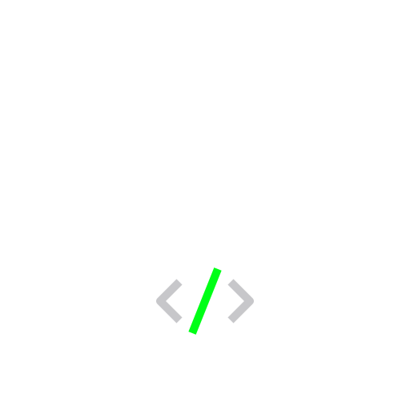

<h1 align="left">
  ✨ Intro ✨
</h1>

  

    Hi, I'm <b>Karthik S Poojary</b> 👨‍💻 — a passionate tech enthusiast from <b>Mangalore</b>, exploring full-stack development and problem-solving.
  

  <!-- Right-aligned image inside same block -->
  

<h1 align="left">
  💡 About Me
</h1>

🎓 Pursuing <b>Information Science & Engineering (ISE)</b> 
📚 Currently learning <b>Next.js, FastAPI, and Cloud Technologies</b> 
💻 Skilled in <b>Python, C++, Databases, and Web Development</b> 
🏋️ Hobbies: <b>Gym, Running, Solving Rubik’s Cube, and Coding</b> 
🎯 Goal: To contribute to <b>open-source projects</b> and grow as a developer

<h1 align="left">
  🛠 Tech Stack
</h1>

  
  
  
  
  
  
  
  
  
  
  
  
  
  
  
  
  
  
  
  
  
  
  
  
  
  
  
  
  
  
  
  
  
  
  
  
  
  
  
  
  
  
  
  
  
  
  
  
  

 

<h1 align="left">
  📊 GitHub Stats
</h1>

  
  

 

<h1 align="left">
  🏆 Contributions
</h1>

<picture>
  <source media="(prefers-color-scheme: dark)" srcset="https://raw.githubusercontent.com/KarthikSP1911/KarthikSP1911/output/pacman-contribution-graph-dark.svg">
  <source media="(prefers-color-scheme: light)" srcset="https://raw.githubusercontent.com/KarthikSP1911/KarthikSP1911/output/pacman-contribution-graph.svg">
  
</picture>
 

<h1 align="left">
  🌐 Connect with Me
</h1>

  
  
  
  

 

<h1 align="left">
  🧩 Competitive Programming
</h1>

  

  

