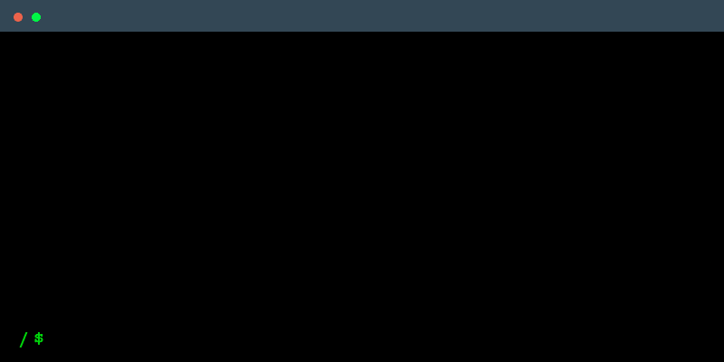

   

<h1 align="left">
  ✨ Intro 
</h1>

<table>
  <tr>
    <td style="border: none; padding-right: 20px; vertical-align: middle;">
      <h2>
        Hi there, I'm 
         
        <b>Karthik S Poojary</b>
        
      </h2>
      

         a passionate tech enthusiast exploring <b>full-stack development</b> and <b>problem-solving</b>.
      

    </td>
    <td style="border: none; padding-left: 20px; vertical-align: middle;">
      
    </td>
  </tr>
</table>

<h1 align="left">
  💡 About Me
</h1>

🎓 Pursuing <b>Information Science & Engineering (ISE)</b> 
📚 Currently learning <b>Next.js, FastAPI, and Cloud Technologies</b> 
💻 Skilled in <b>Python, C++, Databases, and Web Development</b> 
🏋️ Hobbies: <b>Gym, Running, Solving Rubik’s Cube, and Coding</b> 
🎯 Goal: To contribute to <b>open-source projects</b> and grow as a developer

<h1 align="left">
  🛠 Tech Stack
</h1>

  
  
  
  
  
  
  
  
  
  
  
  
  
  
  
  
  
  
  
  
  
  
  
  
  
  
  
  
  
  
  
  
  
  
  
  
  
  
  
  
  
  
  
  
  
  
  
  
  

 

<h1 align="left">
  📊 GitHub Stats
</h1>

  
  

 

<h1 align="left">
  🏆 Contributions
</h1>

<picture>
  <source media="(prefers-color-scheme: dark)" srcset="https://raw.githubusercontent.com/KarthikSP1911/KarthikSP1911/output/pacman-contribution-graph-dark.svg">
  <source media="(prefers-color-scheme: light)" srcset="https://raw.githubusercontent.com/KarthikSP1911/KarthikSP1911/output/pacman-contribution-graph.svg">
  
</picture>

###
 

<h1 align="left">
  🌐 Connect with Me
</h1>

  <!-- LinkedIn (inactive for now) -->
  

  <!-- Twitter (X) -->
  

  <!-- Gmail -->
  

  <!-- Discord -->
  

  <!-- Instagram -->
  

  <!-- Medium -->
  

  <!-- WhatsApp -->
  

  <!-- YouTube (inactive for now) -->
  

 

<h1>
  🧩 Competitive Programming
</h1>

  

<h1>
  💬 Quote
</h1>

<h1>
  💬 My Principles
</h1>

  

 

  <!-- Made with Heart -->
  

  <!-- Visitors -->
  

  <!-- GitHub Stars -->
  

  <!-- Ask Me Anything -->
  

  Made with ❤️ by Karthik

