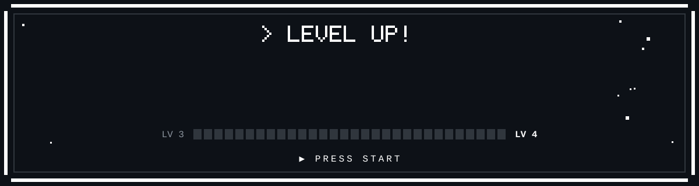
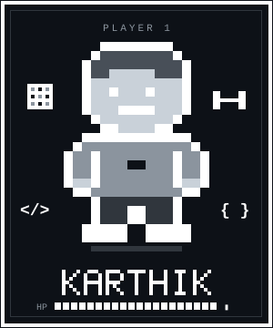
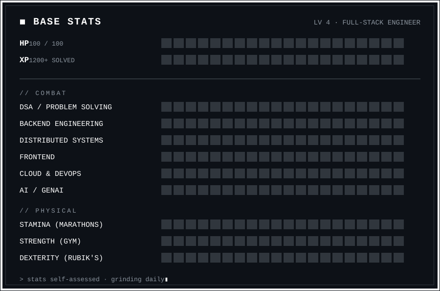
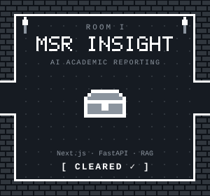
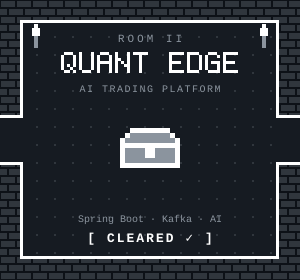
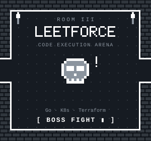

<!-- ================================================================ -->
<!--   PLAYER 1 · CHARACTER SHEET · monochrome edition                -->
<!-- ================================================================ -->

<p align="center">
<picture>
  <source media="(prefers-color-scheme: dark)" srcset="assets/rpg/banner-dark.svg">
  <source media="(prefers-color-scheme: light)" srcset="assets/rpg/banner-light.svg">
  
</picture>
</p>

<p align="center">
  <a href="https://karthiksp1911.vercel.app/"></a>
  <a href="https://linkedin.com/in/karthiksp1911"></a>
  <a href="https://leetcode.com/u/karthiksp1911/"></a>
  <a href="https://codolio.com/profile/karthiksp1911"></a>
  <a href="mailto:karthiksp1911@gmail.com"></a>
</p>

---

## ◼ CHARACTER SHEET

<table>
<tr>
<td width="38%" valign="top" align="center">

<picture>
  <source media="(prefers-color-scheme: dark)" srcset="assets/rpg/hero-dark.svg">
  <source media="(prefers-color-scheme: light)" srcset="assets/rpg/hero-light.svg">
  
</picture>

</td>
<td width="62%" valign="top">

| ATTRIBUTE       | VALUE                                       |
| :-------------- | :------------------------------------------ |
| **Name**        | Karthik S Poojary                           |
| **Class**       | Full-Stack Engineer                         |
| **Subclass**    | Distributed Systems · AI                    |
| **Level**       | 4 — final year, B.E. Information Science    |
| **Guild**       | M S Ramaiah Institute of Technology         |
| **Home Base**   | Bangalore, India                            |
| **Int. Score**  | CGPA 9.38                                   |
| **XP**          | 1200+ problems solved                       |
| **Status**      | `● ONLINE` — open to SDE internships        |

</td>
</tr>
</table>

---

## ◼ BASE STATS

<p align="center">
<picture>
  <source media="(prefers-color-scheme: dark)" srcset="assets/rpg/stats-dark.svg">
  <source media="(prefers-color-scheme: light)" srcset="assets/rpg/stats-light.svg">
  
</picture>
</p>

---

## ◼ INVENTORY

<details open>
<summary><b>⚔ Weapons — Languages</b></summary>
<br/>


</details>

<details open>
<summary><b>🛡 Armor — Frontend</b></summary>
<br/>


</details>

<details open>
<summary><b>⚙ Engines — Backend</b></summary>
<br/>


</details>

<details open>
<summary><b>💾 Storage & Messaging</b></summary>
<br/>


</details>

<details open>
<summary><b>☁ Mounts — Cloud & DevOps</b></summary>
<br/>


</details>

<details open>
<summary><b>✦ Spellbook — AI & GenAI</b></summary>
<br/>


</details>

<details open>
<summary><b>🔧 Utility Belt — Tools</b></summary>
<br/>


</details>

---

## ◼ QUEST LOG

<p align="center"><sub>🗺 DUNGEON MAP — click a room to enter its repo</sub></p>

<p align="center"><a href="https://github.com/KarthikSP1911/MSR-Insight"><picture><source media="(prefers-color-scheme: dark)" srcset="assets/rpg/room-1-dark.svg"><source media="(prefers-color-scheme: light)" srcset="assets/rpg/room-1-light.svg"></picture></a><a href="https://github.com/KarthikSP1911/Quant-Edge"><picture><source media="(prefers-color-scheme: dark)" srcset="assets/rpg/room-2-dark.svg"><source media="(prefers-color-scheme: light)" srcset="assets/rpg/room-2-light.svg"></picture></a><a href="https://github.com/KarthikSP1911/Leetforce"><picture><source media="(prefers-color-scheme: dark)" srcset="assets/rpg/room-3-dark.svg"><source media="(prefers-color-scheme: light)" srcset="assets/rpg/room-3-light.svg"></picture></a></p>

### ▸ Main Quest I — MSR Insight `[COMPLETED]`
> *An AI academic reporting platform that ended the era of manual reports.*

| Party | Duration | Loot (tech) |
| :-- | :-- | :-- |
| 4 players · **Party Leader** | Jan 2026 – May 2026 | Next.js · Express · FastAPI · PostgreSQL · LangChain · RabbitMQ · Redis |

- [x] Lead a 4-member team through delegation, collaboration and delivery
- [x] Automate scraping of the college website to sync student academic data
- [x] Convert offline manual reporting into an online workflow
- [x] Summon a RAG chatbot so proctors can query student insights

**[▶ Play live](https://msrinsight.vercel.app)** · **[⌥ Source](https://github.com/KarthikSP1911/MSR-Insight)**

### ▸ Main Quest II — Quant Edge `[COMPLETED]`
> *An AI-powered stock research & simulated trading platform.*

| Duration | Loot (tech) |
| :-- | :-- |
| Aug 2025 – Nov 2025 | Next.js · Spring Boot · PostgreSQL · Kafka · Qdrant · Spring AI · GraphQL |

- [x] Architect the platform on Spring Boot, Next.js & GraphQL to defeat over-fetching
- [x] Forge a Kafka-backed order-matching engine with low-latency execution
- [x] Build an event-sourced **Portfolio Time Machine** that rebuilds any past state
- [x] Bind a Spring AI + Groq research agent wielding 9 custom tools

**[⌥ Source](https://github.com/KarthikSP1911/Quant-Edge)**

### ▸ Main Quest III — LeetForce `[IN PROGRESS]`
> *A distributed, sandboxed code-execution arena: submit Python, C++, Java or Go and receive a verdict.*

| Status | Loot (tech) |
| :-- | :-- |
| Active | Go · Next.js · PostgreSQL · Redis · Docker · Kubernetes · Terraform · AWS · Prometheus · Grafana |

- [x] Sandbox untrusted code and report verdict, runtime and memory
- [x] Deploy on Kubernetes with Terraform-managed AWS infrastructure
- [x] Add observability with Prometheus + Grafana
- [ ] Next level: ???

**[⌥ Source](https://github.com/KarthikSP1911/Leetforce)**

<p align="center">
  <a href="https://github.com/KarthikSP1911/MSR-Insight"></a>
  <a href="https://github.com/KarthikSP1911/Quant-Edge"></a>
  <a href="https://github.com/KarthikSP1911/Leetforce"></a>
</p>

---

## ◼ ACHIEVEMENTS UNLOCKED

| | Achievement | Description |
| :-: | :-- | :-- |
| ◆ | **Problem Slayer** | 1200+ problems across LeetCode, Codeforces, CodeChef & TUF |
| ◆ | **Hackathon Contender** | Top 50 teams chosen to represent college at Smart India Hackathon 2025 |
| ◆ | **Scholar** | Foundation for Excellence (FFE) Scholarship — merit-cum-need award |
| ◆ | **Endurance Runner** | Top 5 finish in a marathon |
| ◆ | **Academic Elite** | CGPA 9.38 · 96.5% in Pre-University (PCMCs) |
| ◇ | **Cloud Initiate** | AWS Cloud Practitioner Essentials — AWS Skill Builder |
| ◇ | **Security Initiate** | Fundamentals of Cybersecurity — Zscaler Academy |

---

## ◼ THE ARENA — Competitive Programming

| Arena | Rank |
| :-- | :-- |
| LeetCode | **1614** rating |
| Codeforces | **Pupil** |
| CodeChef | **3★** |
| All platforms | **1200+** solved · [Codolio profile](https://codolio.com/profile/karthiksp1911) |

<p align="center">
  <a href="https://leetcode.com/u/karthiksp1911/"></a>
</p>

<p align="center">
  
</p>

---

## ◼ SAVE FILE — GitHub Stats

<p align="center">
  
  
</p>

<p align="center"><sub>⬇ the final boss: pac-man vs. my contribution graph</sub></p>

<picture>
  <source media="(prefers-color-scheme: dark)" srcset="https://raw.githubusercontent.com/KarthikSP1911/KarthikSP1911/output/pacman-contribution-graph-dark.svg">
  <source media="(prefers-color-scheme: light)" srcset="https://raw.githubusercontent.com/KarthikSP1911/KarthikSP1911/output/pacman-contribution-graph.svg">
  
</picture>

---

## ◼ MULTIPLAYER

```text
> Looking for party members: open-source, hackathons, SDE internships.
> Send an invite ↓
```

<p align="center">
  <a href="https://karthiksp1911.vercel.app/">Portfolio</a> ·
  <a href="https://linkedin.com/in/karthiksp1911">LinkedIn</a> ·
  <a href="https://leetcode.com/u/karthiksp1911/">LeetCode</a> ·
  <a href="https://codolio.com/profile/karthiksp1911">Codolio</a> ·
  <a href="mailto:karthiksp1911@gmail.com">karthiksp1911@gmail.com</a>
</p>

<p align="center">
  
</p>

<p align="center"><code>■ GAME SAVED · CONTINUE? [Y/n] ▮</code></p>
